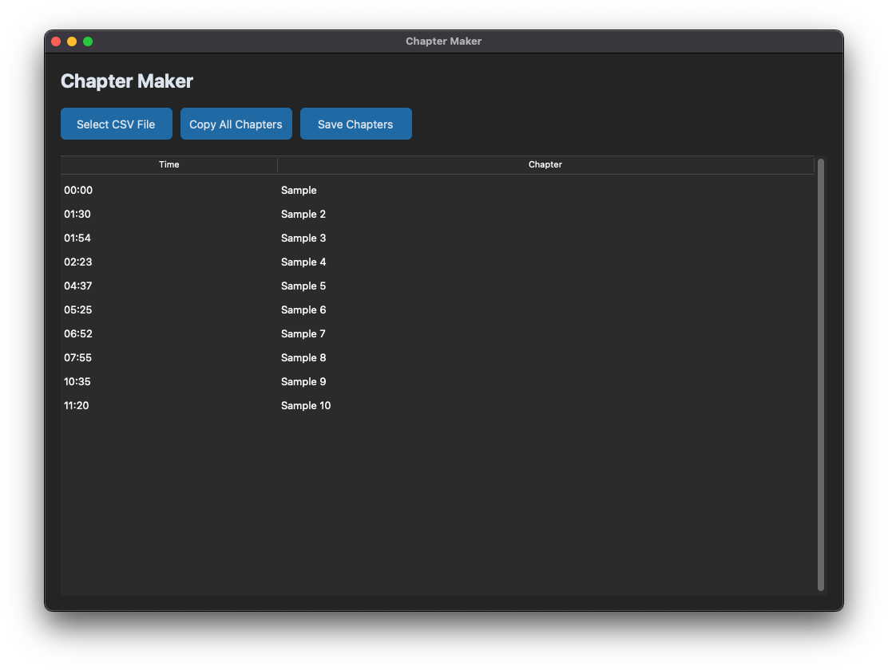
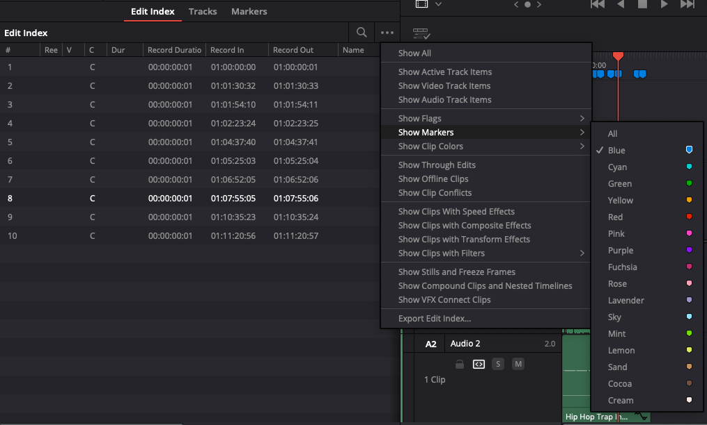
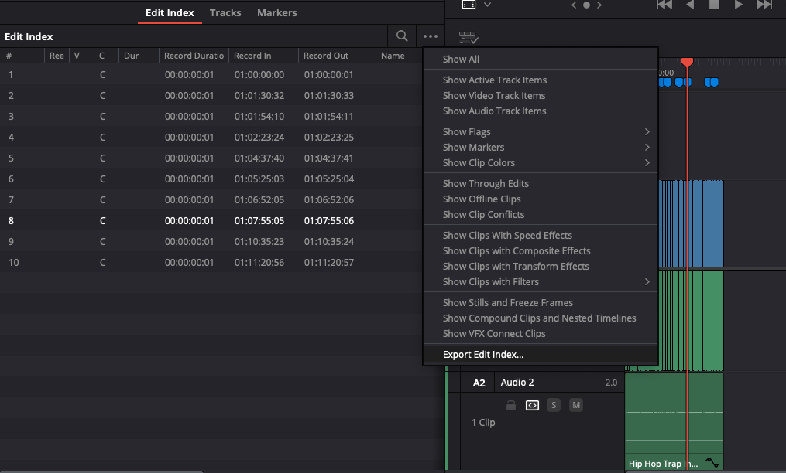

# 📽️ Chapter Maker for DaVinci Resolve

A modern GUI application that converts DaVinci Resolve markers into YouTube chapters format. This tool helps content creators easily generate properly formatted chapter timestamps for their YouTube videos.

## 📸 Screenshots



## ✨ Features

- 🎬 Converts DaVinci Resolve markers to YouTube chapters
- 🌙 Modern dark mode interface
- 📄 CSV export from DaVinci Resolve support
- ⏱️ Automatic time format conversion for YouTube (MM:SS format)
- 📋 One-click copy for easy pasting into YouTube description
- 💾 Save chapters to text file
- 🖥️ Cross-platform support (macOS, Windows, Linux)
- 📁 Source directory-based file saving

## 🎯 Perfect for

- 🎥 Content creators using DaVinci Resolve
- 📺 YouTube video creators
- 🎮 Gaming content creators
- 📚 Tutorial makers
- 🎨 Video editors

## 📋 Requirements

- Python 3.x
- Virtual environment (recommended)
- Dependencies listed in `requirements.txt`

## 🚀 Installation

1. Clone the repository:
```bash
git clone https://github.com/MineraleYT/chapter-maker
cd chapter-maker
```

2. Create a virtual environment:
```bash
python -m venv venv
```

3. Activate the virtual environment:

On macOS/Linux:
```bash
source venv/bin/activate
```

On Windows:
```bash
venv\Scripts\activate
```

4. Install dependencies:
```bash
pip install -r requirements.txt
```

## 📖 Usage

### In DaVinci Resolve:
1. Add markers to your timeline where you want chapters (use a specific color for chapters)
2. Name your markers with chapter titles



3. Export markers:
   - Go to the Index panel
   - Click the three-dot menu (⋮)
   - Filter to show only the marker color you used for chapters
   - Click "Export Index" to save as CSV



### In Chapter Maker:
1. Run the application:
```bash
python chapter-maker.py
```

2. Use the interface:
   - Click "Select CSV File" to choose your exported Index CSV
   - The parsed chapters will appear in the table
   - Click "Copy All Chapters" to copy YouTube-formatted chapters
   - Click "Save Chapters" to save the chapters to a text file

## 📊 CSV Format from DaVinci Resolve

The application expects a CSV file exported from DaVinci Resolve's Index with:
- `Record In`: Timestamp in format HH:MM:SS:FF
- `Notes`: Chapter title/description

## 📤 YouTube Chapter Format

The application automatically formats chapters for YouTube requirements:
- First chapter must start at 00:00
- Each chapter must be at least 10 seconds long
- Format: `MM:SS Chapter Title`

Example output:
```
00:00 Intro
01:30 Main Topic
02:45 Demonstration
05:15 Conclusion
```

## 💡 Tips

- Use a specific marker color for chapters to easily filter them in the Index
- Make sure your first marker in DaVinci Resolve is at the start (00:00)
- Keep chapter titles concise but descriptive
- YouTube requires a minimum of 3 chapters
- Chapters must be in chronological order
- Each chapter must be at least 10 seconds long

## 🎬 Workflow

1. Edit your video in DaVinci Resolve
2. Add colored markers at chapter points
3. Open Index panel and filter by your chapter marker color
4. Export Index to CSV
5. Use Chapter Maker to convert to YouTube format
6. Copy and paste into your YouTube description
